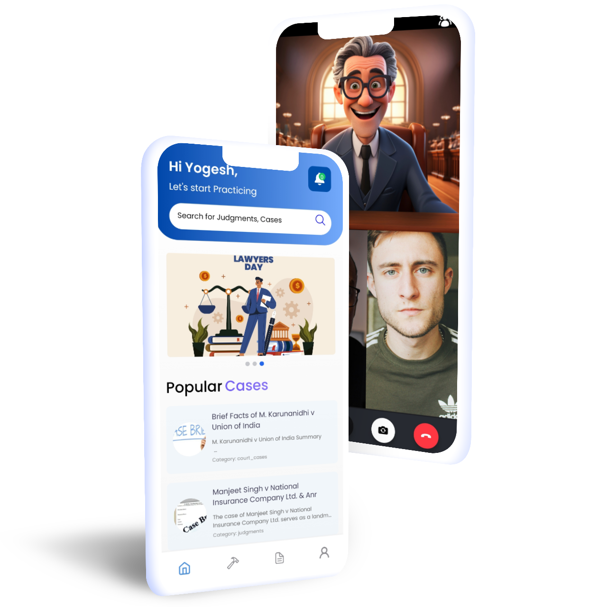
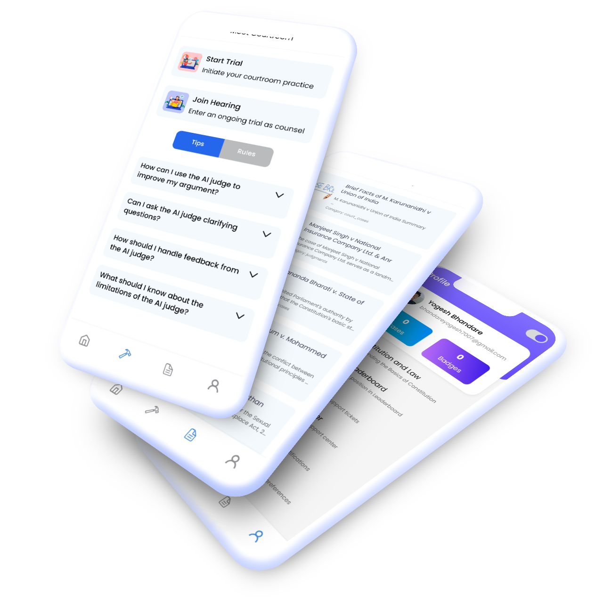

# Lawbook: Redefining Legal Practice for Students

Check out my backend work at [Lawbook Backend API](https://github.com/yogesh-bhandare/lawbook-backend-api) – built by a passionate backend engineer!

### Overview

Lawbook is a cross-platform mobile app designed to revolutionize how law students practice and prepare for trials. By providing a virtual moot court, AI-driven tools, and an extensive case library, Lawbook enables students to refine their legal skills, gain confidence in courtroom proceedings, and excel in their academic and professional pursuits.

### Motivation

Preparing for trials and judgments is often limited to theoretical knowledge or traditional moot court setups. Lawbook bridges this gap by offering a realistic, interactive platform for law students to practice, collaborate, and learn in a virtual environment. The app fosters critical thinking and analytical skills, helping students navigate the complexities of legal practice with ease.

 

### Features
   - **Virtual Moot Court:** Simulate real-life trials via video chat with an AI judge or real participants as judges and opponents.
   - **Document Presentation:** Present, share, and annotate documents during virtual courtroom sessions.
   - **AI Summarized Case Library:** Access a vast repository of cases and judgments, summarized using advanced AI tools.
   - **Progress Tracking:** Monitor skill development with milestone-based badges and detailed performance analytics.

### Tech Stack
- **[Lawbook Backend API](https://github.com/yogesh-bhandare/lawbook-backend-api)** (FastAPI, Python)
   - Powers AI summarization, case library, and data storage with a robust backend.

- **React Native Frontend**
   - **[React Native](https://reactnative.dev/)** - Delivers a seamless, cross-platform experience for Android and iOS devices.
   - **[Stream SDK](https://getstream.io/)** - Powers the virtual courtroom’s video and chat functionality for smooth interactions.
   - **[Reanimated](https://docs.swmansion.com/react-native-reanimated/)** - Built for a modern, animated, and user-friendly interface.
   - **[Clerk](https://clerk.dev/)** - OAuth integration for secure, user-friendly logins.

- **Additional Features**
   - **[PostgreSQL (Neon DB)](https://neon.tech/)** - Reliable database management for user data and case storage.
   - **CI/CD Pipeline:** Uses Docker and GitHub Actions for continuous integration and deployment, ensuring quick updates and scalability.

## Running App

You can download and use the Lawbook app to explore its features and functionality. Click the link below to download the app:

[Download Lawbook App](https://lawbook-apk.s3.us-east-1.amazonaws.com/download/Lawbook.apk)

